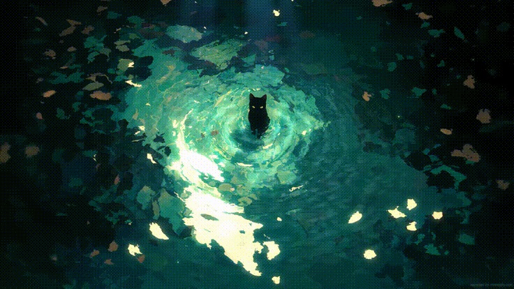

<!-- <h1 align="center">Hi, I'm Bhagyesh Kumar</h1>
<h3 align="center">Undergrad in Mathematics & Computing</h3>
<hr/> -->
# Bhagyesh Kumar (@invi-bhagyesh)
Undergrad in Mathematics & Computing

### Selected Projects
1. Computer Vision

[TopoReformer](https://github.com/invi-bhagyesh/TopoReformer)
> Mitigating Adversarial Attacks Using Topological Purification in OCR Models

2. LLMs

[LM-quant](https://github.com/invi-bhagyesh/LM-quant)
> Benchmarking SLMs on quantization and RLHF effects to measure bias and fairness across standard evaluation datasets.

[LM-collusion](https://github.com/invi-bhagyesh/Agent-Collusion)
> Simulation of LLM agent collusion under Cournot competition strategies

3. Community & Open Source Contributions

[share-lm](https://github.com/shachardon/share-lm)
> Chrome extension that lets you share your open-source conversations

<table align="left" width="80%">
<tr>
  <td></td>
<td width="55%" valign="center" align="center">
  
</td>
<td width="45%" valign="center" align="center" style="font-family: monospace; white-space: pre; color: #00ffaa; background-color: #0c1014; border-radius: 10px; padding: 15px;">


```
⠀⠀⠀⠀⠀⠀⠀⠀⠀⠀⣠⣤⣤⣄⣀⠀⠀⠀⠀⠀⠀⠀⠀⠀⠀⠀⠀
⠀⠀⠀⠀⠀⠀⠀⣴⣿⠟⠛⠛⠛⠿⣿⣿⣿⣿⣶⣤⡀⠀⠀⠀⠀⠀
⠀⠀⠀⠀⣠⣴⣿⡟⠁⢀⣤⣀⠀⠀⠀⠀⠀⠀⠉⠻⣿⣦⠀⠀⠀⠀
⠀⠀⠀⣾⡿⠿⠛⠁⣰⣿⣿⣿⡆⠀⠀⣴⣶⣶⠄⠀⢻⣿⡄⠀⠀⠀
⠀⣾⡿⠁⠀⠀⠀⠀⠻⣿⣿⣿⠃⠀⣼⣿⣿⣿⠀⠀⠀⢿⣷⣄⠀⠀
⣾⣿⠁⠀⣤⣶⡄⠀⠀⠈⠉⠁⠀⠀⠈⠛⠊⠁⠀⠀⠀⠀⠙⢿⣷⠀
⣿⡇⠀⢸⣿⣿⡿⡆⠀⠀⣴⣶⣶⣴⣶⣄⠀⠀⢠⣶⣿⣦⠀⠀⣿⡇
⣿⡇⠀⠀⠛⠙⠉⠀⣰⣿⣿⣿⣿⣿⣿⣿⣇⠀⣿⣿⣿⣿⠀⠀⣿⡇
⣿⣇⠀⠀⠀⠀⢀⣾⣿⣿⣿⣿⣿⣿⣷⣿⣷⡀⠀⠉⠉⠀⠀⣸⣿⠇
⣿⣿⠀⠀⠀⠀⢻⣿⣿⣿⣿⣿⣿⣿⣿⣿⣿⣿⠀⠀⠀⠀⠀⣻⡟⠘
⢹⣿⠀⠀⠀⠀⠀⠉⠛⠉⠁⠉⠁⠙⠻⠿⠟⠀⠀⠀⠀⠀⣾⣿⠁⠀
⠀⣿⡆⠀⠀⠀⠀⠀⠀⠀⠀⠀⠀⠀⠀⠀⠀⠀⠀⠀⠀⠀⣿⡏⠀⠀
⠀⣿⣿⠀⠀⠀⠀⠀⠀⠀⠀⠀⠀⠀⠀⠀⠀⠀⠀⠀⠀⢸⣿⡇⠀⠀
⠀⣻⣿⠀⠀⠀⠀⠀⠀⠀⠀⠀⠀⠀⠀⠀⠀⠀⠀⠀⠀⢸⣿⡇⠀⠀
⠀⢸⣿⡄⠀⠀⠀⠀⠀⠀⠀⠀⠀⠀⠀⠀⠀⠀⠀⠀⠀⢸⣿⡇⠀⠀
```

</td>
<td> 
  </td>
</tr>
</table>
